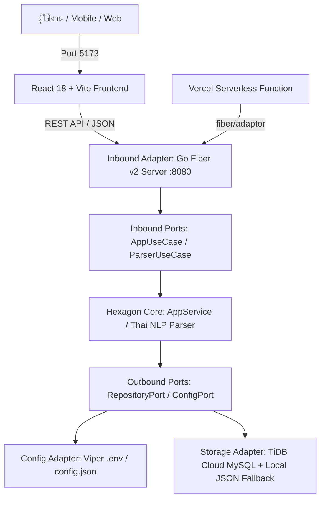

# จดเงิน (Jod Ngen) - Full-Stack App (Frontend: React, Backend: Golang)

แอปพลิเคชันจัดการการเงินส่วนบุคคลสไตล์ Dark Minimalist **"พิมพ์ประโยคเดียว ระบบแยกหมวดให้อัตโนมัติ"** พร้อมระบบติดตามยอดคงเหลือ, รายการผ่อนชำระ, บัตรเครดิต, ค่าใช้จ่ายคงที่รายเดือน และการติดตามหนี้สิน/เงินที่ออกให้ก่อน

---

## สถาปัตยกรรมระบบ (Hexagonal Architecture)



- **Frontend (FE)**: React 18, Vite, IBM Plex Sans Thai & IBM Plex Mono Fonts
  - **แท็บ 1: สรุป (Home)**: ยอดเงินคงเหลือ, สัดส่วนการใช้เงินเทียบกับเงินรับ (Progress bar), ค่าใช้จ่ายคงที่, ยอดผ่อนต่อเดือน, รายการใกล้ครบกำหนด, รายการติดเงิน (กดเคลียร์ได้), และประวัติรายการล่าสุด
  - **แท็บ 2: จด (Add Transaction)**: ช่อง Smart Input พิมพ์ประโยคเดียวระบบแสดง Chip แยกยอด, หมวด, บัญชี, รับ/จ่าย ทันทีแบบเรียลไทม์ พร้อมปุ่มแตะใส่ด่วน และรายการของวันนี้
  - **แท็บ 3: บัญชี (Accounts & Cards)**: สรุป 4 บัญชีธนาคาร (Main, Secondary, Credit, Saving), บัตรเครดิต 3 ใบ (พร้อมฟีเจอร์กระทบยอดกับบิล PDF), และรายการค่าใช้จ่ายคงที่รายเดือน
  - **แท็บ 4: ผ่อน (Installments)**: ยอดผ่อนรวมต่อเดือน และยอดคงเหลือทั้งหมด พร้อมการ์ดรายการผ่อนทั้ง 8 ตัว แสดง Progress Pips ตามงวดที่ชำระ และคำนวณเดือนที่จะผ่อนจบ
  - **Viewport Mode**: ปุ่มสลับมุมมอง "📱 จอมือถือ" (Mobile Frame) หรือ "🖥️ จอกว้าง" (Wide Layout)

- **Backend (BE)**: Hexagonal Architecture (Ports & Adapters)
  - **Framework**: **Go Fiber v2** รวดเร็ว ประสิทธิภาพสูง พร้อม `fiber/adaptor` รองรับ Vercel Serverless Function
  - **Config Management**: **Viper** จัดการ Environment variables (`.env`) และตั้งค่าฐานข้อมูล
  - **Core Domain & Ports**: แยก Business Rules และ Use Cases เป็นอิสระจาก Framework
  - **Data Storage**: รองรับ TiDB Cloud / MySQL พร้อมระบบ Fallback เป็น Local JSON Persistence อัตโนมัติ

---

## วิธีเริ่มต้นรันโปรเจกต์

### รันทั้งสองระบบพร้อมกันในคำสั่งเดียว (แนะนำ)
เปิด PowerShell หรือดับเบิลคลิกไฟล์:
```powershell
.\start-dev.ps1
```
หรือดับเบิลคลิก `start-dev.bat` บนเดสก์ท็อป

### หรือแยกรันทีละระบบ

#### 1. Backend (Golang Hexagonal Fiber Server)
```powershell
go run main.go
# เซิร์ฟเวอร์ทำงานที่ http://localhost:8080
```

#### 2. Frontend (React)
```powershell
cd frontend
npm.cmd run dev
# เข้าใช้งานหน้าเว็บที่ http://localhost:5173
```

---

## รายการ API Endpoints (Backend)

| Method | Endpoint | รายละเอียด |
|---|---|---|
| `GET` | `/api/health` | ตรวจสอบสถานะ Server |
| `GET` | `/api/summary` | ดึงข้อมูลสรุปหน้าแรก (เหลือใช้, ใช้ไป, ค่าคงที่, ผ่อน, Dues, Debts, Recent) |
| `GET` | `/api/transactions` | ดึงประวัติรายการธุรกรรมทั้งหมด |
| `POST` | `/api/transactions` | เพิ่มรายการใหม่ (รองรับทั้งส่ง text ดิบให้ตัดคำ หรือแยกฟิลด์) |
| `DELETE` | `/api/transactions/{id}` | ลบรายการธุรกรรม |
| `GET` | `/api/debts` | ดึงรายการติดเงิน |
| `PUT` | `/api/debts/{id}` | สลับสถานะ เคลียร์แล้ว / ค้างชำระ |
| `GET` | `/api/accounts` | ดึงข้อมูล 4 บัญชี, บัตรเครดิต, และค่าใช้จ่ายคงที่ |
| `PUT` | `/api/fixed/{id}` | สลับสถานะการจ่ายของบิลคงที่ |
| `GET` | `/api/plans` | ดึงรายการผ่อนชำระทั้ง 8 รายการ |
| `POST` | `/api/parse` | ทดสอบวิเคราะห์ข้อความภาษาไทยเพื่อแยกหมวดและจำนวนเงิน |

---

## ตัวอย่างการใช้งาน Smart Input ในหน้า "จด"
คุณสามารถพิมพ์ประโยคสั้นๆ ภาษาไทย แล้วระบบจะตรวจจับตัวเลขและหมวดหมู่ให้อัตโนมัติ:
- `กาแฟ 120` ➔ หมวด: กาแฟ (Main)
- `ข้าวมันไก่ 65` ➔ หมวด: อาหาร (Main)
- `เติมน้ำมัน ปตท 900` ➔ หมวด: น้ำมันรถ (Main)
- `เซเว่น 180` ➔ หมวด: อาหาร (Main)
- `ออกให้เพื่อน 500` ➔ หมวด: ออกให้ก่อน (Main)
- `โอนเงินเก็บ 5000` ➔ หมวด: เงินเก็บ (Saving)
- `เงินเดือน 45000` ➔ หมวด: รายรับ (รายรับ)
